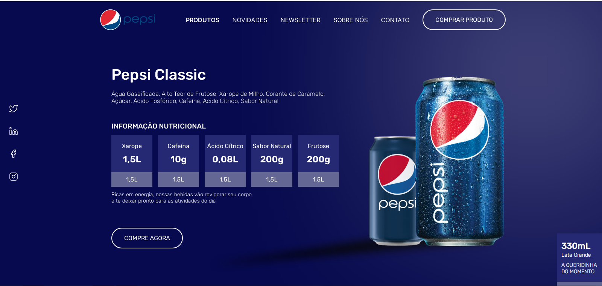

<h1 align="center"> Landing Page Pepsi </h1>

Programa gratuito, apresentado como vídeo aula no canal Senhor Programador de Gustavo Polonio no Youtube.  

  <a href="#-tecnologias">Tecnologias</a>&nbsp;&nbsp;&nbsp;|&nbsp;&nbsp;&nbsp;
  <a href="#-projeto">Projeto</a>&nbsp;&nbsp;&nbsp;|&nbsp;&nbsp;&nbsp;
  <a href="#-layout">Layout</a>&nbsp;&nbsp;&nbsp;|&nbsp;&nbsp;&nbsp;
  <a href="#memo-licença">Licença</a>

 

  

## 🚀 Tecnologias

Esse projeto foi desenvolvido com as seguintes tecnologias:

- HTML e CSS
- Git e Github
- Figma

## 💻 Projeto

Essa Landing Page da Pepsi foi desenvolvida em uma aula no Youtube no canal Senhor Programador, seguindo um layout do Figma desenvolvido por Victory (designer do projeto): https://twitter.com/vickst0rm, utilizei para aprendizado de HTML e CSS.

## 🔖 Layout

Você pode visualizar o layout do projeto através [DESSE LINK](https://www.figma.com/file/WIe7VhDwhVYr4r0HWTZxfL/Landing-Page-Pepsi?type=design&node-id=1-89&mode=design&t=L8vykz2so3MUMWgP-0). É necessário ter conta no [Figma](https://figma.com) para acessá-lo.

## 📝 Licença

Esse projeto foi desenvolvido como aula em aprendizado por um vídeo no Youtube no cana Senhor Programador de Gustavo Polonio.

---

Feito com ♥ by Wellington Sato 👋 